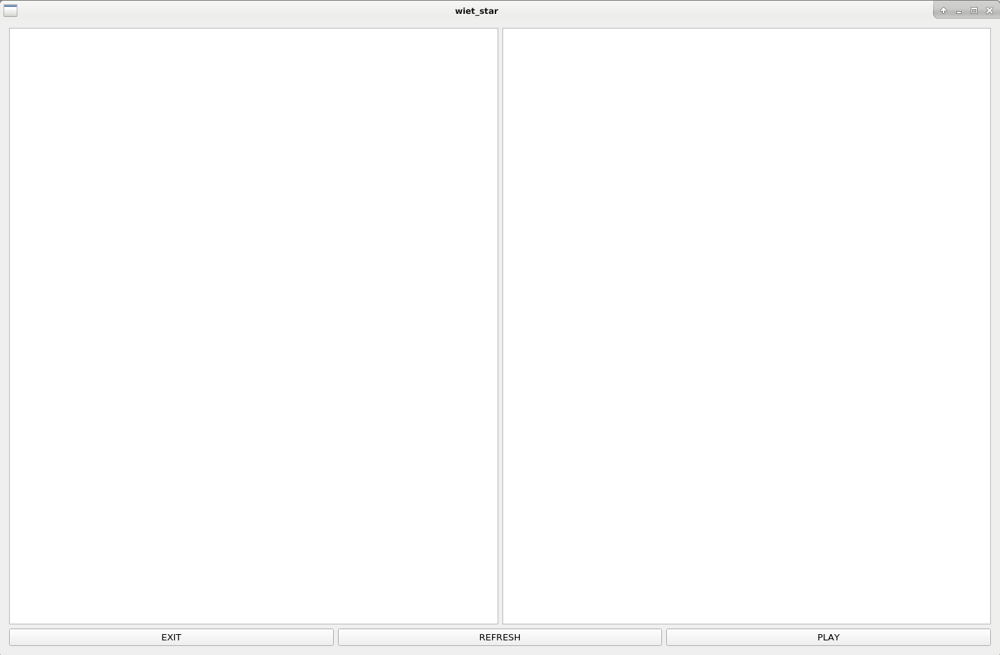
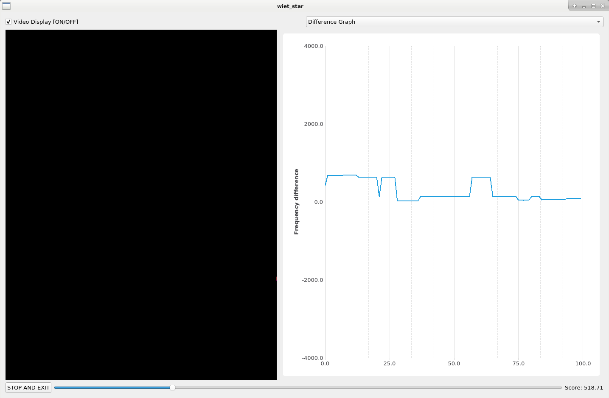
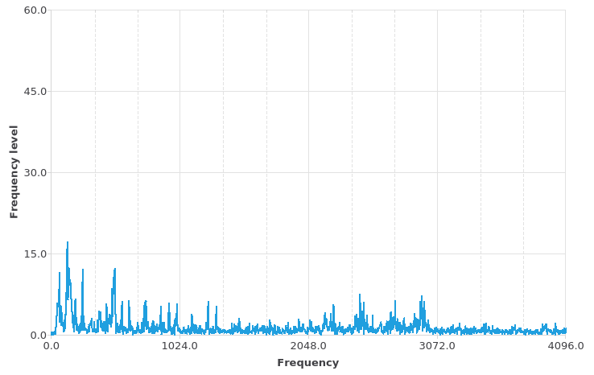
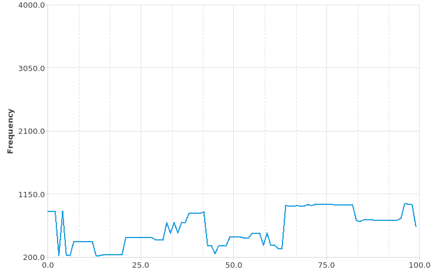
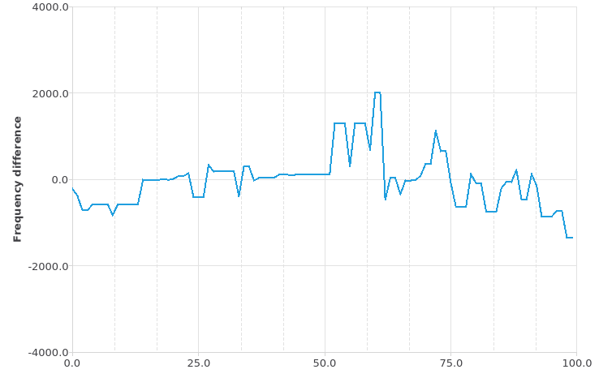

# WIET-Star
A karaoke-based video game.

## Dependencies
* A compiler supporting C++17
* Qt5 libraries (some can be found in `wiet_star.pro`

## Installation
The project is a standard Qt5 project so their building tools apply.

## Usage
### Playlist
Place `.mp4` files in the playlist directory which is specified in `main.cpp`.
Usage of other music formats requires changes in the `wiet_star_window` class.

### Gameplay
Connect a microphone to your device. Some changes to the input settings may be
required. Start the program, choose a song from the
list and press the `PLAY` button.

The closer to the original you sing, the more points you get. You can see your
progress on the difference graph. Adjust the volume if necessary.

Graphs for the specific sound sources are also available.

## Design
Gifs of some of the graphs produced by the software (getting the Fourier
transform requiers code changes but it looks awesome :>).
* The Fourier transform of input for the sound source:

* Spectogram created from the Fourier transform:

* The difference graph comparing spectograms from two different sources

